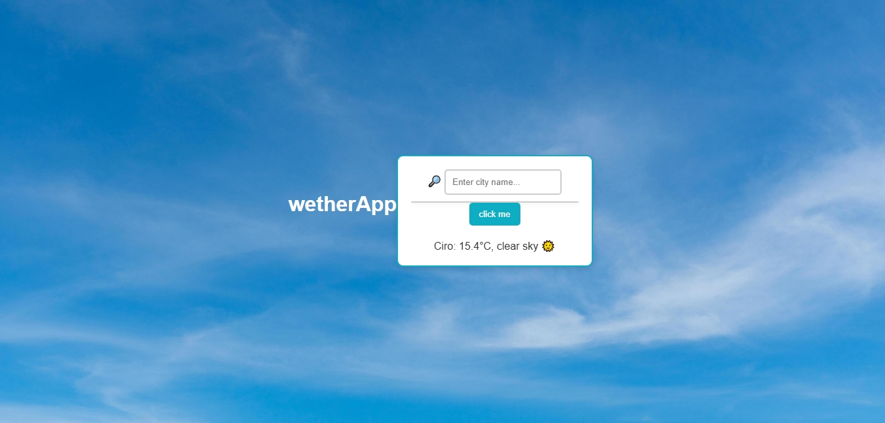
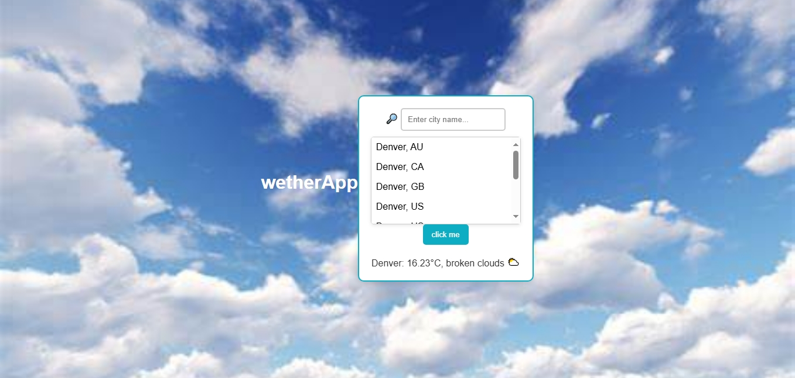
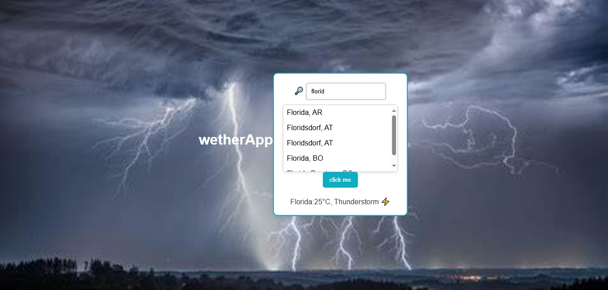
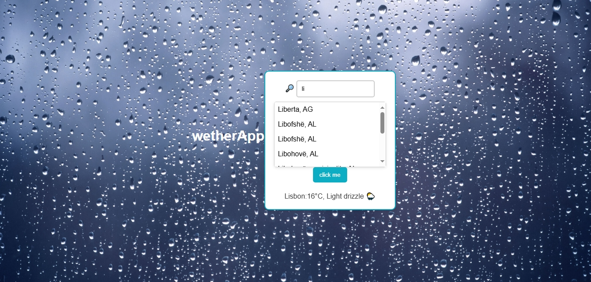
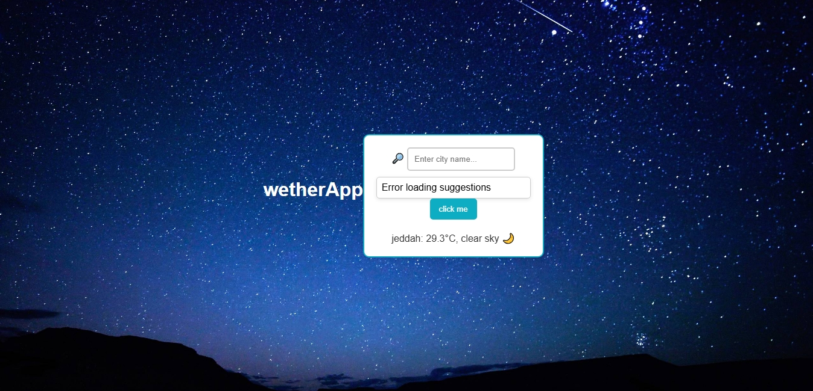
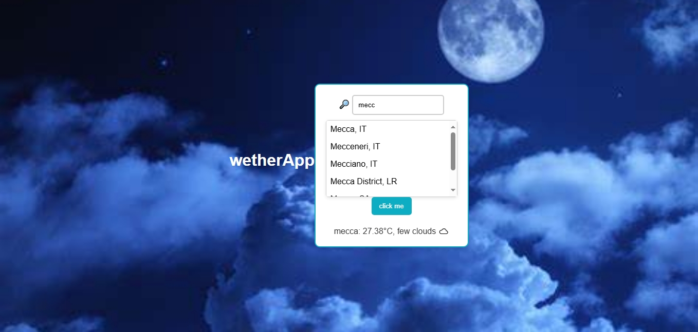
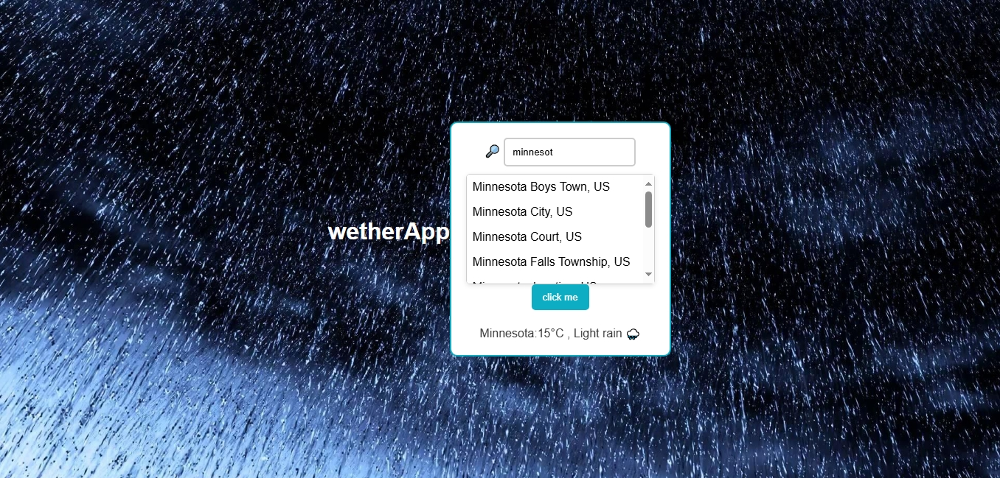
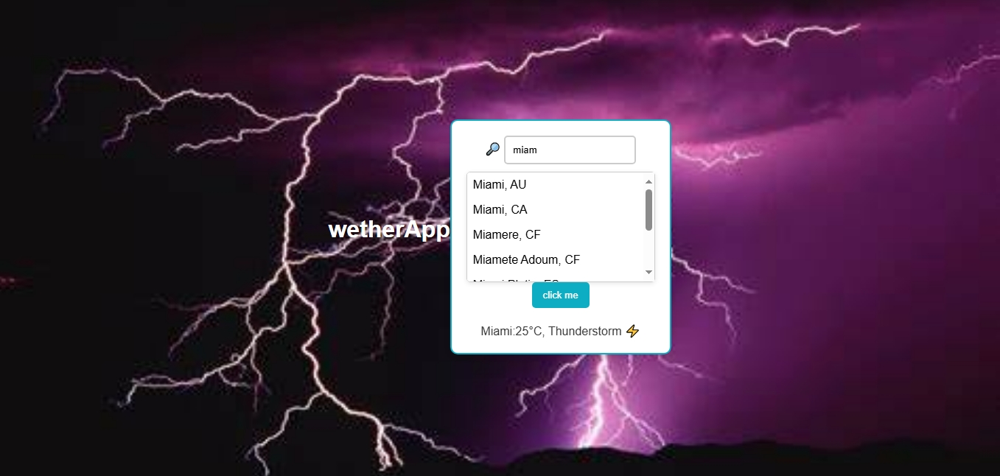

## 🌐 [Live Demo](https://mousacr7.github.io/weather-app/)

# 🌦️ Weather App

## 📘 Introduction

Welcome to the **Weather App**! This app provides real-time weather data for any city in the world. Users can:

- 🔍 Search for cities  
- 🌡️ View current weather conditions  
- 🖼️ See dynamic icons and background images based on weather and time (day/night)  
- 🧠 Get real-time city name suggestions while typing  

---

## ✨ Features

- 🔎 **City Search**: Type a city name to get real-time weather info.
- 🌤️ **Weather Conditions**:
  - ☀️ Clear Sky
  - ☁️ Cloudy
  - 🌧️ Rain
  - ⚡ Thunderstorm
  - 🌦️ Drizzle
- 🧠 **Suggestions**: As you type, city name suggestions appear.
- 🔄 **Dynamic Icons**: Icons change based on weather conditions.
- 🌗 **Day/Night Mode**: Background changes depending on local time.
- ❌ **Default Image**: Shown when the city can't be found or data fails.

---

## ☀️🌙 Weather Condition Previews

# 🌞 Daytime Weather

**Clear**

**Cloudy**

**Rain**

**Thunderstorm**

**Drizzle**

## 🌙 Nighttime Weather

**Clear**

**Cloudy**

**Rain**

**Thunderstorm**

**Drizzle**

🖼️ Default

**Default (Error or Unknown)**

---

## ⚙️ Setup Instructions

### ✅ Prerequisites

- A code editor (e.g., VS Code)  
- A modern web browser  
- An API key from [RapidAPI](https://rapidapi.com)

---

### 🚀 Installation

1. Clone the repository:
   git clone https://github.com/your-username/weather-app.git
   cd weather-app
Open the index.html file in your browser.

Replace the API key line in app.js:

javascript

'X-RapidAPI-Key': 'YOUR_API_KEY',
🔐 Note: Don’t expose your API key in a public repo. Use environment variables or a backend server for security.

#### 🧪 How to Use
🏙️ Search for a City: Type a city name.

🌡️ View Weather: See description, temperature, and icon.

🔍 Suggestions: Relevant city names will appear as you type.

🌗 Day/Night Mode: Background updates based on local time.

❌ Error Handling: If city not found, the default image and message will display.

##### 🛠️ Troubleshooting
❌ API Key Issue: Check if the API key is correct and valid.

🏙️ City Not Found: Recheck spelling or try another city.

🌐 Empty Data: Possible API/network/server issue.

📄 License
This project is licensed under the MIT License – see the LICENSE file for details.
